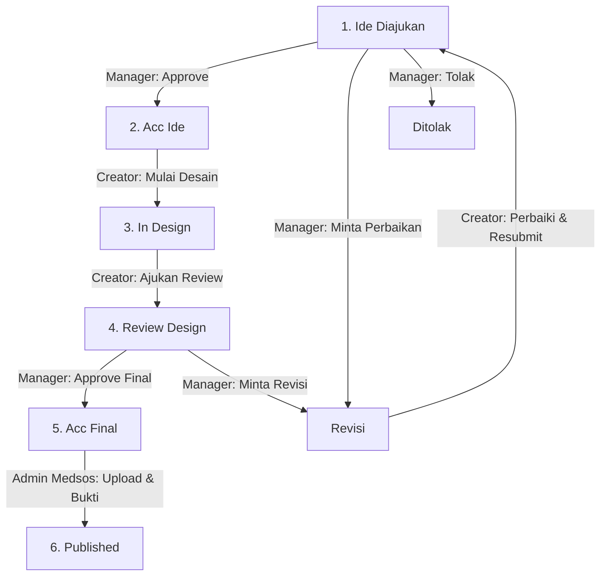
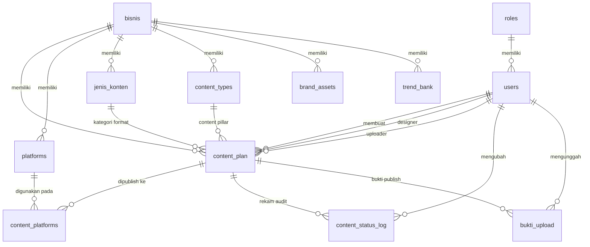

# 🚀 Dokumentasi Sistem Manajemen Media Sosial (SMMS) — Multi-Bisnis

Dokumentasi lengkap mengenai **arsitektur, alur bisnis, relasi tabel database, hak akses role, dan panduan penggunaan** Sistem Manajemen Media Sosial (SMMS).

---

## 📋 Daftar Isi

1. [Ikhtisar Sistem & Fitur Multi-Bisnis](#-ikhtisar-sistem--fitur-multi-bisnis)
2. [Alur Bisnis & Workflow Produksi Konten](#-alur-bisnis--workflow-produksi-konten)
3. [Hak Akses & Matriks Role (RBAC)](#-hak-akses--matriks-role-rbac)
4. [Struktur Database & Relasi Tabel (ERD)](#-struktur-database--relasi-tabel-erd)
5. [Detail Tabel Database](#-detail-tabel-database)
6. [Panduan Instalasi & Perintah Spark](#-panduan-instalasi--perintah-spark)
7. [Akun Pengguna Default untuk Pengujian](#-akun-pengguna-default-untuk-pengujian)

---

## 🏢 Ikhtisar Sistem & Fitur Multi-Bisnis

Sistem Manajemen Media Sosial (SMMS) dirancang untuk mengelola produksi konten sosial media secara terstruktur untuk **multi-bisnis / multi-account** (maksimal 4 bisnis aktif sekaligus).

### 🔑 Fitur Utama Multi-Bisnis:
- **Session-Based Business Switcher**: Pengguna dapat berpindah bisnis aktif kapan saja melalui dropdown switcher di Topbar tanpa harus logout.
- **Isolasi Data Penuh per Bisnis**: Seluruh data (`Content Plan`, `Platform Medsos`, `Jenis Konten`, `Content Pillar`, `Brand Assets`, dan `Bank Trend AI`) terisolasi 100% mandiri untuk setiap bisnis.
- **Identitas Visual Berwarna**: Setiap bisnis memiliki warna identitas (HEX Color) yang menghiasi badge di topbar, sidebar, dan kartu manajemen bisnis.

---

## 🔄 Alur Bisnis & Workflow Produksi Konten

Produksi konten dalam SMMS mengikuti alur **State Machine** 8 tahapan dengan kontrol transisi yang ketat.



### 📌 Keterangan Tahapan Status:
1. **`ide_diajukan`**: Ide konten baru dibuat oleh Content Creator / Manager.
2. **`acc_ide`**: Ide disetujui oleh Manager untuk lanjut ke tahap pembuatan aset/desain.
3. **`in_design`**: Content Creator / Designer sedang mengerjakan desain visual & draft caption.
4. **`review_design`**: Desain & caption selesai dikerjakan, diajukan untuk di-review Manager.
5. **`revisi`**: Manager meminta perbaikan (wajib menyertakan catatan revisi).
6. **`acc_final`**: Desain & caption telah disetujui final oleh Manager, siap diunggah.
7. **`published`**: Admin Medsos telah mengunggah konten ke media sosial & memasukkan bukti upload.
8. **`ditolak`**: Ide konten ditolak oleh Manager.

---

## 👥 Hak Akses & Matriks Role (RBAC)

Aplikasi memiliki 5 role pengguna utama dengan wewenang yang terpisah:

| Fitur / Halaman | Superadmin | Owner | Manager | Content Creator | Admin Medsos |
|-----------------|:----------:|:-----:|:-------:|:---------------:|:------------:|
| **Business Switcher** | ✅ | ✅ | ✅ | ✅ | ✅ |
| **Manajemen Bisnis (CRUD)** | ✅ | ✅ | ❌ | ❌ | ❌ |
| **Manajemen User (CRUD)** | ✅ | ❌ | ❌ | ❌ | ❌ |
| **Master Data (Pillar, Jenis, Platform)** | ✅ | ✅ | ❌ | ❌ | ❌ |
| **Pengajuan Ide Konten** | ✅ | ✅ | ✅ | ✅ | ❌ |
| **Approval Ide & Desain** | ✅ | ✅ | ✅ | ❌ | ❌ |
| **Pengerjaan Desain & Task** | ✅ | ✅ | ❌ | ✅ | ❌ |
| **Upload & Input Bukti Publish** | ✅ | ✅ | ❌ | ❌ | ✅ |
| **Kalender Tayang & Laporan** | ✅ | ✅ | ✅ | ✅ | ✅ |
| **Brand Assets & AI Trend Bank** | ✅ | ✅ | ✅ | ✅ | ✅ |

---

## 🗄️ Struktur Database & Relasi Tabel (ERD)

Berikut adalah diagram relasi antar tabel dalam database SMMS:



---

## 📄 Detail Tabel Database

### 1. `bisnis` (Tabel Utama Bisnis/Brand)
| Kolom | Tipe Data | Keterangan |
|-------|-----------|------------|
| `id` | INT (PK) | Auto increment ID bisnis |
| `nama_bisnis` | VARCHAR(100) | Nama bisnis / brand |
| `deskripsi` | TEXT | Deskripsi singkat bisnis |
| `warna` | VARCHAR(7) | Kode warna HEX identitas (contoh: `#6C5CE7`) |
| `logo_url` | VARCHAR(255) | URL logo / icon bisnis |
| `status` | ENUM | `aktif`, `nonaktif` |
| `urutan` | INT | Urutan tampilan di switcher |

### 2. `content_plan` (Tabel Utama Plan Konten)
| Kolom | Tipe Data | Keterangan |
|-------|-----------|------------|
| `id` | INT (PK) | Auto increment ID konten |
| `bisnis_id` | INT (FK) | Relasi ke `bisnis.id` |
| `judul_konten` | VARCHAR(200) | Judul / topik ide konten |
| `deskripsi` | TEXT | Brief ide / instruksi visual |
| `caption` | TEXT | Draft teks caption sosmed |
| `tanggal_publish` | DATE | Tanggal rencana tayang |
| `jenis_konten_id` | INT (FK) | Relasi ke `jenis_konten.id` |
| `content_type_id` | INT (FK) | Relasi ke `content_types.id` (Pillar) |
| `status` | ENUM | 8 status state machine |
| `assigned_designer` | INT (FK) | Relasi ke `users.id` (Creator/Designer) |
| `assigned_uploader` | INT (FK) | Relasi ke `users.id` (Admin Medsos) |
| `image_url` | VARCHAR(255) | URL gambar preview |
| `design_url` | VARCHAR(255) | Link Canva / Google Drive |

### 3. `content_status_log` (Tabel Audit Trail Status)
| Kolom | Tipe Data | Keterangan |
|-------|-----------|------------|
| `id` | INT (PK) | Auto increment ID log |
| `content_id` | INT (FK) | Relasi ke `content_plan.id` |
| `status_lama` | VARCHAR(30) | Status sebelum diubah |
| `status_baru` | VARCHAR(30) | Status setelah diubah |
| `user_id` | INT (FK) | Relasi ke `users.id` (pelaku ubah) |
| `catatan` | TEXT | Catatan revisi / penolakan |

### 4. Master Data Terisolasi per Bisnis
- **`platforms`**: Nama platform sosial media (Instagram, TikTok, YouTube, dll).
- **`jenis_konten`**: Format konten (Reels, Carousel, Static Post, Story, dll).
- **`content_types`**: Content Pillar / Kategori (Edukasi, Promosi, Hiburan, Testimoni, dll).

---

## 🚀 Panduan Instalasi & Perintah Spark

### 1. Konfigurasi File `.env`
Pastikan file `.env` sudah sesuai dengan environment lokal Anda:
```ini
CI_ENVIRONMENT = development

database.default.hostname = localhost
database.default.database = sistem_manajemen_sosmed
database.default.username = root
database.default.password = 
database.default.DBDriver = MySQLi
```

### 2. Perintah Migration & Seeding
Jalankan perintah berikut di terminal untuk menyiapkan skema & data sampel:

```bash
# Jalankan seluruh migrasi database
php spark migrate --all

# Jalankan seeder data utama & data sampel 4 bisnis
php spark db:seed DatabaseSeeder
```

---

## 🔑 Akun Pengguna Default untuk Pengujian

Gunakan akun default berikut untuk mencoba berbagai hak akses role pada aplikasi (Password untuk semua akun: `admin123`):

| Role | Email | Password | Akses Utama |
|------|-------|----------|-------------|
| **Superadmin** | `admin@smm.local` | `admin123` | Akses Penuh Sistem & User Management |
| **Owner** | `owner@smm.local` | `admin123` | Master Data, Master Bisnis, & Laporan |
| **Manager** | `manager@smm.local` | `admin123` | Approval Ide, Desain, & Rejection/Revisi |
| **Content Creator** | `creator@smm.local` | `admin123` | Pengajuan Ide & Pengerjaan Desain Task |
| **Admin Medsos** | `sosmed@smm.local` | `admin123` | Antrean Upload & Input Bukti Publish |

---

> [!TIP]
> **Petunjuk Cepat Penggunaan Multi-Bisnis:**
> 1. Login menggunakan salah satu akun di atas.
> 2. Klik **Dropdown Bisnis** di baris Topbar atas untuk berpindah antar bisnis (*SMMS Digital Agency*, *Toko Kopi Nusantara*, *GlowSkin Beauty*, *FitLife Apparel*).
> 3. Seluruh data konten plan, ide, kalender, dan laporan akan otomatis berubah sesuai bisnis yang dipilih.
