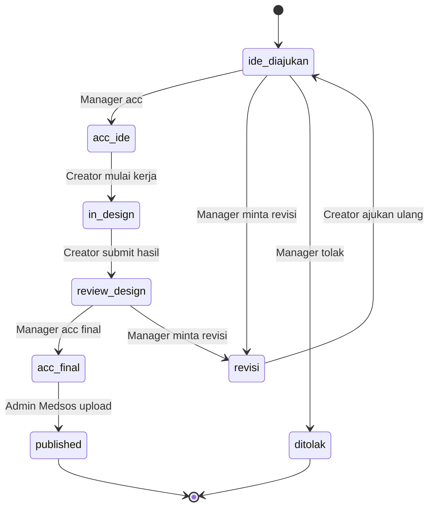

# Rancangan Sistem Social Media Management (Internal)

> Dokumen kerja — skema database, state machine approval, dan permission matrix.
> Dibuat sebagai acuan pengembangan supaya tidak hilang arah saat implementasi.
> Sistem ini untuk **penggunaan internal 1 tim** — tidak ada konsep multi-klien.

---

## 1. Ringkasan Alur Bisnis

Alur kerja tim (dari catatan awal):

```
Tim Kreatif cari ide → Manager acc ide → Design → Content Creator acc →
Manager acc final → Admin Medsos upload
```

---

## 2. Aktor & Role

| Role | Kode | Tanggung Jawab Utama |
|---|---|---|
| Superadmin | `superadmin` | Akses teknis penuh ke seluruh sistem — kelola akun user, definisi role, master data. Biasanya dipegang developer/IT internal |
| Owner | `owner` | Pimpinan/penanggung jawab tim — akses penuh ke seluruh konten & user, kelola master data |
| Manager | `manager` | Acc ide, acc final sebelum upload, minta revisi |
| Content Creator / Designer | `content_creator` | Ajukan ide, buat design, submit hasil, resubmit setelah revisi |
| Admin Medsos | `admin_medsos` | Upload/publish konten yang sudah acc final, catat bukti upload |

Karena tidak ada konsep klien, role di sini adalah **atribut global per user** —
satu user punya satu role tetap, cukup disimpan sebagai kolom di tabel `users`
(lihat 3.2), tidak perlu tabel pivot.

---

## 3. Skema Database

### 3.1 `roles`
| Kolom | Tipe | Keterangan |
|---|---|---|
| id | INT, PK | |
| kode_role | VARCHAR(30) | `superadmin`, `owner`, `manager`, `content_creator`, `admin_medsos` |
| nama_role | VARCHAR(50) | label tampilan |

> Isi tabel ini via seeder, bukan CRUD dari UI — role bersifat tetap (fixed) untuk
> menjaga konsistensi state machine di bagian 4.

### 3.2 `users` (tambahan ke tabel yang sudah ada)
| Kolom | Tipe | Keterangan |
|---|---|---|
| role_id | INT, FK → roles.id | **baru** — role tetap user ini |
| status | ENUM('aktif','nonaktif') | **baru** — nonaktifkan akses tanpa hapus akun |

### 3.3 `platforms` (sudah ada, tidak berubah)
| Kolom | Tipe | Keterangan |
|---|---|---|
| id | INT, PK | |
| nama_platform | VARCHAR(50) | |
| status | ENUM('aktif','nonaktif') | |

### 3.4 `jenis_konten` (Content Type — sudah ada, tidak berubah)
| Kolom | Tipe | Keterangan |
|---|---|---|
| id | INT, PK | |
| nama_jenis | VARCHAR(50) | |
| keterangan | TEXT | nullable |

### 3.5 `content_types` (Content Pillar — sudah ada, tidak berubah)
| Kolom | Tipe | Keterangan |
|---|---|---|
| id | INT, PK | |
| nama_type | VARCHAR(50) | |

### 3.6 `content_plan` (tabel utama — diperluas)
| Kolom | Tipe | Keterangan |
|---|---|---|
| id | INT, PK | |
| judul_konten | VARCHAR(200) | |
| deskripsi | TEXT | nullable |
| tanggal_publish | DATE | |
| jenis_konten_id | INT, FK → jenis_konten.id | nullable |
| content_type_id | INT, FK → content_types.id | nullable |
| status | VARCHAR(30) | lihat state machine bagian 4 |
| dibuat_oleh | INT, FK → users.id | **baru** — pengusul ide |
| assigned_designer | INT, FK → users.id | nullable, **baru** |
| assigned_uploader | INT, FK → users.id | nullable, **baru** |
| created_at, updated_at | DATETIME | |

### 3.7 `content_platforms` (pivot konten ↔ platform)
| Kolom | Tipe |
|---|---|
| id | INT, PK |
| content_id | INT, FK → content_plan.id |
| platform_id | INT, FK → platforms.id |

### 3.8 `content_assets` (sudah ada secara konsep — link desain per platform)
| Kolom | Tipe | Keterangan |
|---|---|---|
| id | INT, PK | |
| content_id | INT, FK → content_plan.id | |
| platform_id | INT, FK → platforms.id | |
| asset_nama | VARCHAR(150) | nullable |
| asset_link | VARCHAR(255) | |
| keterangan | TEXT | nullable |

### 3.9 `content_status_log` (audit trail + catatan revisi — **baru**)
| Kolom | Tipe | Keterangan |
|---|---|---|
| id | INT, PK | |
| content_id | INT, FK → content_plan.id | |
| status_lama | VARCHAR(30) | nullable (null kalau ini status pertama) |
| status_baru | VARCHAR(30) | |
| user_id | INT, FK → users.id | siapa yang melakukan perubahan |
| catatan | TEXT | nullable — wajib diisi untuk transisi ke `revisi` |
| created_at | DATETIME | |

### 3.10 `bukti_upload` (opsional, untuk lengkapi status published — **baru**)
| Kolom | Tipe | Keterangan |
|---|---|---|
| id | INT, PK | |
| content_id | INT, FK → content_plan.id | |
| platform_id | INT, FK → platforms.id | |
| link_postingan | VARCHAR(255) | |
| uploaded_by | INT, FK → users.id | |
| uploaded_at | DATETIME | |

---

## 4. State Machine Approval

### 4.1 Daftar Status

| Status | Arti |
|---|---|
| `ide_diajukan` | Ide baru diusulkan Tim Kreatif/Content Creator |
| `acc_ide` | Manager menyetujui ide, siap masuk proses design |
| `in_design` | Sedang dikerjakan Content Creator/Designer |
| `review_design` | Hasil design disubmit, menunggu review Manager |
| `revisi` | Ditolak sementara, perlu perbaikan (bisa terjadi dari `ide_diajukan` atau `review_design`) |
| `acc_final` | Manager menyetujui hasil akhir, siap upload |
| `published` | Sudah diupload Admin Medsos |
| `ditolak` | Ide ditolak permanen, tidak dilanjutkan |

### 4.2 Diagram Alur



### 4.3 Tabel Transisi (jadi acuan validasi di backend)

| Dari | Ke | Role yang boleh | Catatan wajib? |
|---|---|---|---|
| `ide_diajukan` | `acc_ide` | manager | tidak |
| `ide_diajukan` | `revisi` | manager | **ya** |
| `ide_diajukan` | `ditolak` | manager | **ya** |
| `revisi` | `ide_diajukan` | content_creator | tidak |
| `acc_ide` | `in_design` | content_creator | tidak |
| `in_design` | `review_design` | content_creator | tidak |
| `review_design` | `acc_final` | manager | tidak |
| `review_design` | `revisi` | manager | **ya** |
| `acc_final` | `published` | admin_medsos | tidak |

> Implementasi: buat satu fungsi terpusat `canTransition($contentId, $statusBaru, $userId)`
> yang mengecek: (1) apakah transisi status_lama→status_baru valid menurut tabel di
> atas, (2) apakah role user termasuk role yang diizinkan untuk transisi itu, (3)
> kalau catatan wajib, apakah catatan diisi. Semua endpoint update status **wajib**
> lewat fungsi ini — jangan biarkan status di-update langsung dari form generik
> seperti kode Content Plan yang sekarang (`f-status` dropdown bebas).

### 4.4 Owner & Superadmin
Role `owner` dan `superadmin` bisa override semua transisi (untuk kasus darurat /
koreksi), tapi setiap override tetap wajib masuk `content_status_log` dengan
catatan supaya tetap ada jejak audit. Bedanya: `owner` override untuk alasan
operasional (misal ingin percepat approval), sedangkan `superadmin` override
biasanya untuk perbaikan data/teknis (misal status salah akibat bug) — kalau
memungkinkan, biarkan hanya `owner` yang override untuk alasan operasional
sehari-hari, dan `superadmin` dipakai seperlunya saja.

---

## 5. Permission Matrix

| Aksi | superadmin | owner | manager | content_creator | admin_medsos |
|---|---|---|---|---|---|
| Kelola akun user & definisi role | ✅ | ❌ | ❌ | ❌ | ❌ |
| Kelola master data (platform/jenis/pillar) | ✅ | ✅ | ❌ | ❌ | ❌ |
| Buat ide konten baru | ✅ | ✅ | ✅ | ✅ | ❌ |
| Edit konten (sebelum acc_final) | ✅ | ✅ | ✅ | ✅ (miliknya) | ❌ |
| Upload/isi bukti publish | ✅ | ✅ | ❌ | ❌ | ✅ |
| Lihat semua konten | ✅ | ✅ | ✅ | ✅ | ✅ |
| Hapus konten | ✅ | ✅ | ✅ | ❌ | ❌ |

---

## 6. Endpoint yang Disarankan (CodeIgniter 4)

```
GET   /dashboard/content-plan               → list + kalender
POST  /dashboard/content-plan/store
POST  /dashboard/content-plan/update/{id}
POST  /dashboard/content-plan/transition/{id}
        body: { status_baru, catatan? }
        → jalankan canTransition(), simpan ke content_status_log

GET   /dashboard/content-plan/{id}/log      → riwayat status & catatan

POST  /dashboard/master/user-role/store     → set role user (superadmin & owner)
```

---

## 7. Urutan Pengerjaan

1. **Tabel `roles`** (seeder, isi 5 role tetap: superadmin, owner, manager,
   content_creator, admin_medsos) + tambah kolom `role_id` dan `status` di
   tabel `users`.
2. **Fungsi `canTransition()`** + endpoint `transition/{id}` menggantikan
   dropdown status bebas yang sekarang ada di form Content Plan.
3. **Tabel `content_status_log`** — tampilkan sebagai timeline di modal detail
   konten (siapa acc/minta revisi, kapan, catatan apa).
4. **Dashboard per role** — query bawaan berbeda: manager lihat status
   `ide_diajukan`/`review_design` yang menunggu dia; content_creator lihat
   `acc_ide`/`revisi` miliknya; admin_medsos lihat `acc_final`.
5. **Tabel `bukti_upload`** — dilengkapi setelah admin medsos publish (bisa
   menyusul, bukan prioritas pertama).

---

## 8. Ide Pengembangan Lanjutan (belum digarap sekarang)

- Bank ide konten terpisah (sebelum masuk `content_plan`)
- Notifikasi in-app untuk antrean approval
- Laporan performa konten per bulan

---

## 9. Fitur Berbasis AI

AI di sini diposisikan sebagai **asisten yang mempercepat kerja manusia**, bukan
pengganti approval manusia — semua output AI tetap harus melalui state machine
approval di bagian 4 sebelum jadi konten final.

### 9.1 AI Idea Generator (di Bank Ide / saat ajukan ide baru)
Input: content pillar, jenis konten, opsional kata kunci tren → AI mengeluarkan
beberapa judul + deskripsi singkat ide. Tim kreatif memilih/edit, bukan langsung
dipakai mentah sebagai `ide_diajukan`.

### 9.2 AI Caption/Copy Assistant (saat proses `in_design` / submit)
Tombol "Bantu tulis caption" — input: judul konten, platform, deskripsi singkat,
tone (santai/formal/promosi) → output draft caption + hashtag relevan. Tetap
disimpan sebagai draft yang bisa diedit sebelum masuk `review_design`.

### 9.3 AI Pre-Review Checklist (otomatis saat status → `review_design`)
Sebelum antre ke Manager, jalankan pengecekan otomatis: ejaan/tata bahasa,
kelengkapan link asset, kesesuaian tone dengan brand guideline (kalau ada).
Hasilnya masuk sebagai catatan otomatis di `content_status_log` — tujuannya
mempercepat review Manager, dia langsung lihat potensi masalah tanpa mengecek
manual dari nol. Ini fitur yang paling langsung nyambung ke workflow approval
yang sedang dibangun sekarang.

### 9.4 Ringkasan Perubahan saat Revisi
Kalau konten pernah masuk status `revisi` lebih dari sekali, AI bikin ringkasan
singkat "apa yang berubah dari versi sebelumnya" (bandingkan deskripsi/caption
lama vs baru dari `content_status_log`) — supaya Manager tidak perlu baca ulang
semua riwayat dari awal.

### 9.5 Rekomendasi Waktu Posting Optimal
Setelah data `bukti_upload` + engagement terkumpul cukup, AI sarankan
jam/tanggal posting terbaik per platform berdasarkan pola historis.

### 9.6 Ringkasan Performa Pasca-Publish
Bulanan: rangkum performa konten (kalau data engagement tersedia dari API
platform) jadi insight singkat, misalnya jenis konten mana yang paling efektif.

### 9.7 Asisten Tanya-Jawab Dashboard
Kotak chat kecil di dashboard: "ada berapa konten yang masih revisi bulan ini?"
dijawab berdasarkan data `content_plan` real-time.

### 9.8 Tabel Tambahan: `ai_generation_log`

| Kolom | Tipe | Keterangan |
|---|---|---|
| id | INT, PK | |
| content_id | INT, FK → content_plan.id | nullable (idea generator belum tentu punya content_id) |
| user_id | INT, FK → users.id | siapa yang memicu |
| fitur | VARCHAR(30) | `idea_gen`, `caption_gen`, `prereview`, `revision_summary`, `insight`, `qa` |
| prompt_input | TEXT | |
| output | TEXT | |
| created_at | DATETIME | |

Gunanya: audit kualitas output AI, dan kalau nanti pakai API berbayar, ini jadi
dasar tracking biaya per fitur.

### 9.9 Prioritas Kalau Mau Mulai dari AI

Karena fokus sekarang masih di role & approval workflow, urutan yang paling
nyambung kalau mau tambah AI setelahnya:

1. **9.3 Pre-Review Checklist** — langsung mempercepat titik approval yang baru
   dibangun (review_design), dampaknya paling terasa lebih dulu.
2. **9.2 Caption Assistant** — mengurangi waktu di tahap `in_design`.
3. **9.4 Ringkasan Revisi** — pelengkap `content_status_log` yang sudah ada.
4. Sisanya (9.1, 9.5–9.7) lebih cocok setelah data historis konten cukup banyak
   terkumpul, supaya rekomendasinya relevan.
